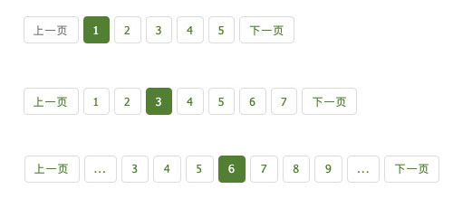

## page-number 分页

一个分页模块，可以使用在 Koa.js 或 Express.js 中




### 演示站点
- http://javascript.net.cn

### 安装
```
npm install --save page-number
```

### 使用方法
```
const pagination = require('page-number');

let page = ctx.query.page ? parseInt(ctx.query.page) : 1; //页码
let perPage = 15; // 每页显示条数
let start = perPage * (page - 1); // 偏移


// 获取文章总数，创建文章分页
var sql = 'SELECT COUNT(*) AS num FROM tb_article WHERE is_show = 1';
var articleCounter = await db.query(sql, { type: db.QueryTypes.SELECT, replacements });

var pagination = pagination.paginate(ctx, page, articleCounter[0]['num'], perPage);
data.pagination = pagination;
```

#### Ejs 中直接输出 pagination 即可
```
<%- pagination %>
```
生成HTML如下：
```
<ul class="pagination pagination-sm nav">
  <li class="page-item">
    <a class="page-link" href="/?id=16063&page=21" aria-label="Previous">
      <span aria-hidden="true">上一页</span>
      <span class="sr-only">Previous</span>
    </a>
  </li>
  <li class="page-item"><a class="page-link">...</a></li>
  <li class="page-item"><a class="page-link" href="/?id=16063&page=19">19</a></li>
  <li class="page-item"><a class="page-link" href="/?id=16063&page=20">20</a></li>
  <li class="page-item"><a class="page-link" href="/?id=16063&page=21">21</a></li>
  <li class="page-item active"><a class="page-link">22</a></li>
  <li class="page-item"><a class="page-link" href="/?id=16063&page=23">23</a></li>
  <li class="page-item"><a class="page-link" href="/?id=16063&page=24">24</a></li>
  <li class="page-item"><a class="page-link" href="/?id=16063&page=25">25</a></li>
  <li class="page-item"><a class="page-link">...</a></li>
  <li class="page-item">
    <a class="page-link" href="/?id=16063&page=23" aria-label="Next">
      <span aria-hidden="true">下一页</span>
      <span class="sr-only">Next</span>
    </a>
  </li>
</ul>
```

#### SASS 样式
可以直接使用 Bootstrap 3.4 中的分页样式，可以直接使用，也可以自定义。


### 作者
 - Author: ngtwewy <62006464@qq.com>
 - Author URI: http://javascript.net.cn
 - Project URI: https://github.com/ngtwewy/page-number
 - License: Apache Licence 2.0
 - License URI: http://www.apache.org/licenses/LICENSE-2.0
 